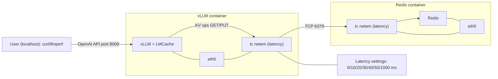
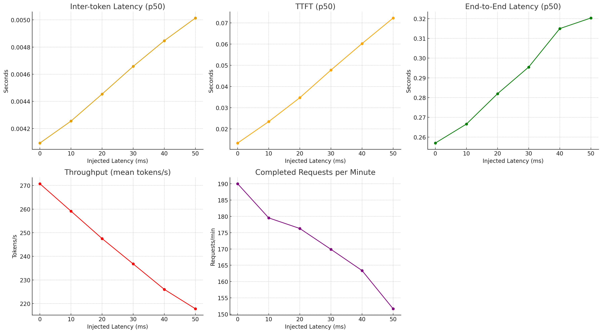

# LMCache Network Perf

## Purpose
This repository contains the experimental setup and results for benchmarking the LMCache network under various latency conditions. The goal is to evaluate the performance impact of network latency on LMCache using standardized benchmarking tools.

## Methodology
We conducted experiments by simulating different network latency values and measuring the system's performance. The experiments were performed using the llmperf benchmarking tool to ensure reliable and comparable results.

## Latency Settings
The following latency values were tested during the experiments:
- 0ms
- 10ms
- 20ms
- 30ms
- 40ms
- 50ms
- 1000ms

## Tool Usage
The benchmarking was carried out using [llmperf](https://github.com/ray-project/llmperf), which provides a comprehensive framework for evaluating language model performance under various conditions.

## Usage

To run the experiment, first start the containers:

```sh
docker-compose up -d
```

Then, set the desired round-trip latency between vLLM+LMCache and Redis by running:

```sh
./scripts/latency.sh <RTT_MS>
```

This command applies the specified `<RTT_MS>` latency to the network communication between the vLLM+LMCache container and the Redis container.

```sh
RAY_memory_usage_threshold=0.99
RAY_num_cpus=1
OPENAI_API_BASE="http://127.0.0.1:8000/v1"
OPENAI_API_KEY="sk-local"
python token_benchmark_ray.py   --model "Qwen/Qwen3-0.6B"   --mean-input-tokens 128   --stddev-input-tokens 32   --mean-output-tokens 64   --stddev-output-tokens 16   --max-num-completed-requests 50   --timeout 300   --num-concurrent-requests 1   --results-dir "result_outputs/0ms"   --llm-api openai   --additional-sampling-params '{}'
```

## Experiment Topology



The user sends requests from the localhost to the vLLM API server. LMCache inside the vLLM container performs KV operations against Redis over TCP. Network latency is injected using tc netem on each container's eth0. We tested with X ∈ {0, 10, 20, 30, 40, 50, 1000} ms.

## Results



| RTT (ms) | TTFT p50 (s) | E2E p50 (s) | Throughput Mean (tok/s) | Overall Output Throughput (tok/s) | Inter-token Mean (s) | Completed per Min |
|----------|--------------|-------------|--------------------------|-----------------------------------|----------------------|-------------------|
| 0        | 0.0133       | 0.257       | 270.75                   | 229.76                            | 0.00471              | 189.99            |
| 10       | 0.0235       | 0.2666      | 259.15                   | 216.44                            | 0.00499              | 179.52            |
| 20       | 0.0347       | 0.282       | 247.52                   | 212.35                            | 0.00509              | 176.27            |
| 30       | 0.0478       | 0.2955      | 236.79                   | 205.11                            | 0.00532              | 169.89            |
| 40       | 0.0602       | 0.315       | 226.01                   | 197.21                            | 0.00554              | 163.39            |
| 50       | 0.0723       | 0.3203      | 217.78                   | 183.32                            | 0.00597              | 151.67            |
| 1000     | 2.3079       | 2.5736      | 30.34                    | 22.92                             | 0.0489               | 19.00             |

The results show that TTFT increases most significantly as network latency grows, indicating initial token generation is highly sensitive to latency. Inter-token latency changes only slightly across tested RTTs, suggesting token streaming remains relatively stable. Both throughput and completed requests per minute steadily decrease with higher latency, reflecting overall performance degradation. At 1000ms RTT, all metrics exhibit extreme degradation, confirming strong negative impact of network delay. Despite LMCache’s KV caching, network latency remains a dominant factor affecting system responsiveness and throughput in this setup.

In summary, while LMCache provides caching benefits, when it is deployed in a **remote configuration** with Redis or another backend storage over the network, the overall system performance is heavily impacted by network latency.