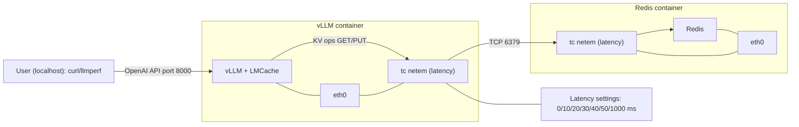

# LMCache Network Benchmark

## Purpose
This repository contains the experimental setup and results for benchmarking the LMCache network under various latency conditions. The goal is to evaluate the performance impact of network latency on LMCache using standardized benchmarking tools.

## Methodology
We conducted experiments by simulating different network latency values and measuring the system's performance. The experiments were performed using the llmperf benchmarking tool to ensure reliable and comparable results.

## Latency Settings
The following latency values were tested during the experiments:
- 0ms
- 10ms
- 20ms
- 30ms
- 40ms
- 50ms
- 1000ms

## Tool Usage
The benchmarking was carried out using [llmperf](https://github.com/ray-project/llmperf), which provides a comprehensive framework for evaluating language model performance under various conditions.

This repository serves as a public resource containing all relevant scripts, configurations, and results for the LMCache network latency experiments.

```sh
RAY_memory_usage_threshold=0.99
RAY_num_cpus=1
OPENAI_API_BASE="http://127.0.0.1:8000/v1"
OPENAI_API_KEY="sk-local"
python token_benchmark_ray.py   --model "Qwen/Qwen3-0.6B"   --mean-input-tokens 128   --stddev-input-tokens 32   --mean-output-tokens 64   --stddev-output-tokens 16   --max-num-completed-requests 50   --timeout 300   --num-concurrent-requests 1   --results-dir "result_outputs/0ms"   --llm-api openai   --additional-sampling-params '{}'
```

## Experiment Topology



The user sends requests from the localhost to the vLLM API server. LMCache inside the vLLM container performs KV operations against Redis over TCP. Network latency is injected using tc netem on each container's eth0. We tested with X ∈ {0, 10, 20, 30, 40, 50, 1000} ms.

## Results